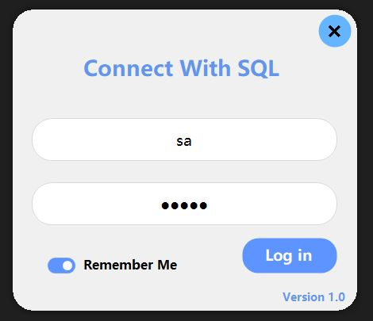
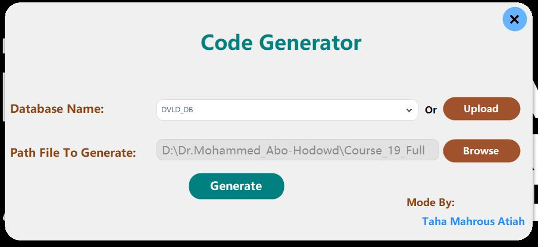
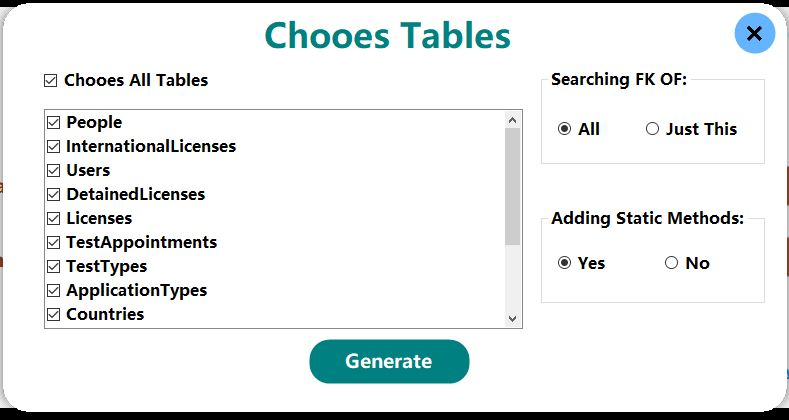

# 🚀 Code Generator for Data Access and Business Layers

[](https://learn.microsoft.com/en-us/dotnet/csharp/)
[](https://dotnet.microsoft.com/)
[](https://www.microsoft.com/en-us/sql-server)
[](https://opensource.org/licenses/MIT)

This project automates the generation of efficient and reliable code for interacting with a database, including data access and business logic. With the added feature of stored procedure generation, it further simplifies database operations by providing ready-to-use stored procedures for CRUD operations. ✨

---

## 🌟 Key Features

*   **📦 Generates C# classes for data access logic:**
    *   Retrieves data by ID using stored procedures.
    *   Checks for record existence using stored procedures.
    *   Adds new records using stored procedures.
    *   Updates existing records using stored procedures.
    *   Deletes records using stored procedures.
    *   Retrieves all records using stored procedures.
*   **🧠 Generates C# classes for business layer logic:**
    *   Manages interactions with data access classes.
    *   Enforces business rules and validation.
*   **⚙️ Generates stored procedures (New Feature!):**
    *   The code generator now creates stored procedures for the selected tables, streamlining your database layer setup.

---

## 📖 Usage

1.  **🏃 Run the Code Generator:** Open the `Code Generator.sln` form in a C# development environment (like Visual Studio).
2.  **🎯 Select Database and Table:**
    *   Choose your desired database from the **"Databases"** dropdown.
    *   Select the specific table from the **"Database Tables"** grid for which you want to generate classes and stored procedures.
3.  **⚡ Generate Classes and Stored Procedures:** Click the appropriate button to generate classes for the **Data Access Layer**, **Business Layer**, or both, along with their corresponding stored procedures.
4.  **👀 View Generated Code:** The newly generated code will be displayed in the **"Generated Code"** textbox, ready for you to copy and use.

---

## 📂 Generated Code Structure

### 📊 Data Access Layer Classes
*   Reside in a separate namespace (e.g., `DataAccessLayer`).
*   Contain methods for interacting with the database using generated stored procedures.

    ```csharp
    // Example of a generated Data Access class
    namespace DataAccessLayer
    {
        public class clsPerson
        {
            public static DataTable GetAllPeople()
            {
                // Code to execute usp_GetAllPeople stored procedure
                return clsDataAccessSettings.GetData("usp_GetAllPeople");
            }

            public static int AddNewPerson(string firstName, string lastName)
            {
                // Code to execute usp_AddNewPerson stored procedure
            }
        }
    }
    ```

### 🧠 Business Layer Classes
*   Reside in a separate namespace (e.g., `BusinessLayer`).
*   Interact with data access classes to implement business logic.

    ```csharp
    // Example of a generated Business class
    namespace BusinessLayer
    {
        public class clsPerson
        {
            private DataAccessLayer.clsPerson _dataAccess = new DataAccessLayer.clsPerson();

            public int Id { get; set; }
            public string FirstName { get; set; }
            public string LastName { get; set; }

            public bool Save()
            {
                // Business validation logic here
                if (string.IsNullOrEmpty(FirstName))
                    return false;

                // Call Data Access Layer
                this.Id = _dataAccess.AddNewPerson(this.FirstName, this.LastName);
                return this.Id != -1;
            }
        }
    }
    ```

### 🗄️ Stored Procedures
*   Generated for your selected tables (e.g., `usp_GetAll[TableName]`, `usp_AddNew[TableName]`).
    ```sql
    -- Example of a generated Stored Procedure
    CREATE PROCEDURE usp_GetAllPeople
    AS
    BEGIN
        SELECT PersonID, FirstName, LastName FROM People
    END
    GO
    ```

---

## 📝 Additional Notes

*   The generated code utilizes **`clsDataAccessSettings`** for database connection details.
*   Feel free to customize the generated code further to fit specific project needs, such as modifying the stored procedures or adding additional functionality.

---

## 📸 Application Screenshots

### Login Interface (`frmLogin`)

*Secure login form with validation and attempt tracking.*

### Main Dashboard (`frmMain`)

*Dashboard showing system statistics.*

### Manage Accounts (`frmChooesTables`)

*Interface for managing Chooes Tables.*

---

## ©️ Copyright

**© 2026 Taha Mahrous. All rights reserved.**